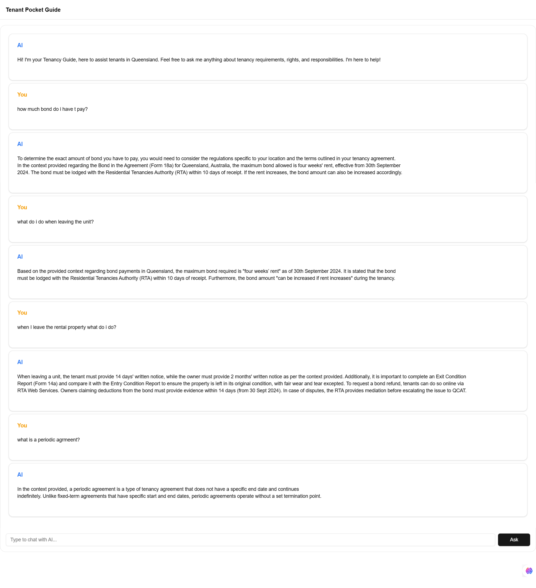

## Project
1- Clone the project to your local machine using `git clone git@github.com:saimaAnis21/RAG-Chatbot.git` 
2- CD into the project directory
3- Run `npm install` to install the dependancies
4- Now run the development server: npm run dev
5- Open [http://localhost:3000](http://localhost:3000) with your browser to see the result.

## Tech Stack used
[Next.js](https://nextjs.org)
TypeScript
LangChain
Pinecone
